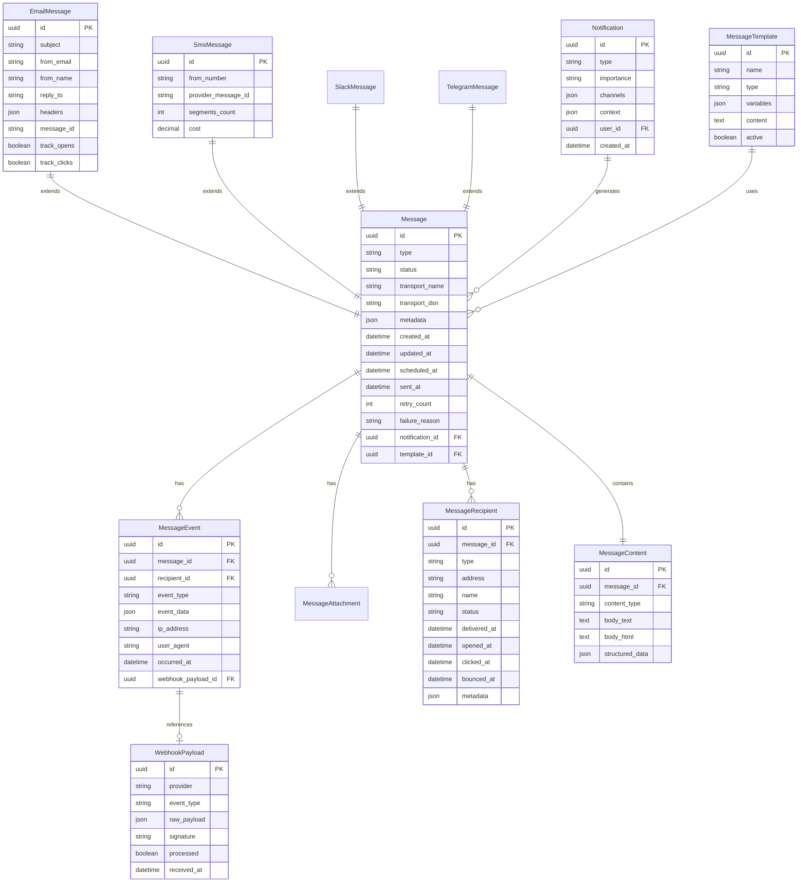

# Database Schema Design

## Entity Relationship Diagram

## Indexes
- `idx_message_status` on Message(status)
- `idx_message_sent_at` on Message(sent_at)
- `idx_message_notification` on Message(notification_id)
- `idx_recipient_message` on MessageRecipient(message_id)
- `idx_event_message` on MessageEvent(message_id)
- `idx_event_type_date` on MessageEvent(event_type, occurred_at)
- `idx_webhook_provider_processed` on WebhookPayload(provider, processed)